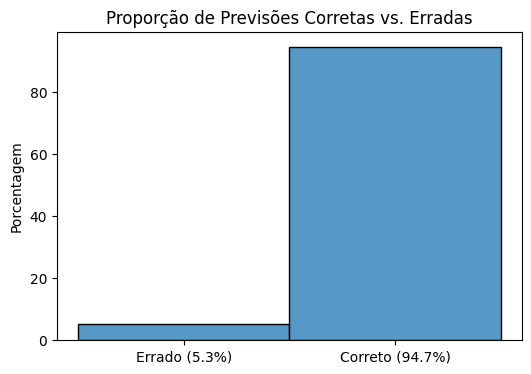
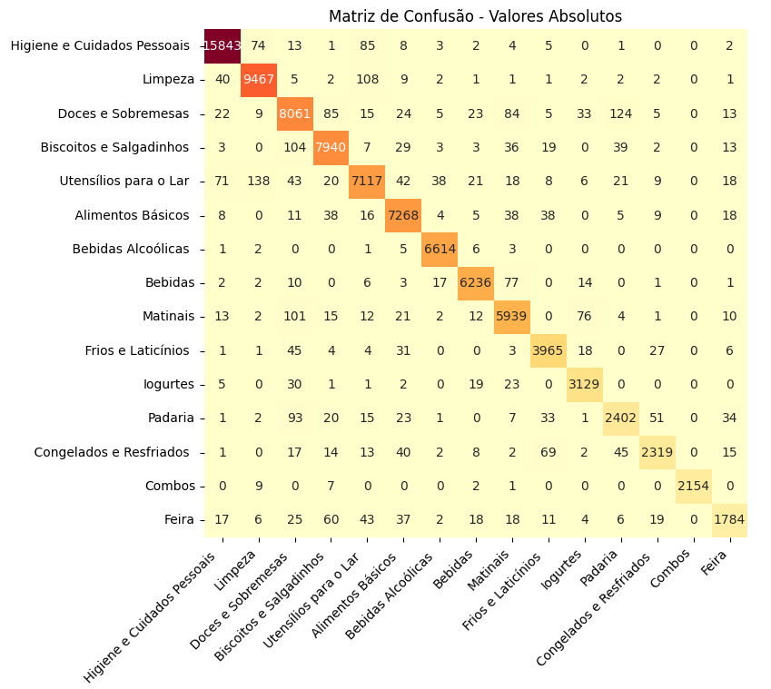

# Classificação de Produtos nos Corredores de Supermercado - iFood 🛒

## Descrição do Projeto 📝

Recentemente, eu desenvolvi um projeto chamado [Análise de Preços no iFood](https://github.com/theylor999/Analise-de-Precos-no-iFood), onde obtive um conjunto de **15 milhões de dados** de produtos de supermercados espalhados pelo Brasil 🇧🇷. Esses dados foram coletados diretamente do iFood para realizar uma análise de preços e comparar diferentes produtos.

Como estou atualmente estudando **Machine Learning** 🤖, decidi usar esses dados para criar um **modelo de classificação** que, dado o nome de um produto, possa prever o corredor onde ele se encontra dentro de um supermercado 🏪.

### Limitações no Conjunto de Dados ⚠️

Os dados originais são muito grandes para serem adicionados diretamente ao repositório, então, devido ao tamanho e limitações de armazenamento, decidi colocar um **arquivo de exemplo em formato .txt** no lugar dos dados completos. Esse arquivo contém um pequeno subconjunto dos dados para ilustrar como o processo funciona.

### Desafio com o Corredor "Combos" 🚫

Durante o desenvolvimento do modelo, enfrentei um problema relacionado a um corredor específico: o **corredor "Combos"**. Esse corredor é uma mistura de todos os outros corredores, mas com uma quantidade muito alta de produtos, o que causou desequilíbrio no modelo de classificação ⚖️.

Para melhorar o desempenho e a precisão do modelo, decidi **remover o corredor "Combos"** do treinamento, pois ele introduzia ruído e comprometia a capacidade do modelo de aprender as características específicas dos outros corredores 🔧.

## Explicação do Código 💻

O código segue a estrutura de um pipeline simples para treinar o modelo de classificação. Aqui está o passo a passo do que foi feito:

1. **Pré-processamento dos Dados** 🧹:
   - Carreguei os dados do meu database MySQL.
   - Realizei o **pré-processamento** para limpar e formatar os dados, removendo valores nulos e normalizando os textos.
   - A principal variável de interesse era o **nome do produto**, que foi usada para prever o corredor do produto.

2. **Vetores e Representação dos Dados 📊**:
   - Para lidar com a representação textual do nome dos produtos, utilizei uma técnica de **vetorização de texto**. No caso, a abordagem mais simples foi a **TF-IDF**, que converte os nomes dos produtos em vetores numéricos, representando a frequência das palavras no contexto do produto.
   - Isso é fundamental para que o modelo de machine learning entenda as relações entre os diferentes nomes de produtos e os corredores.

3. **Modelo de Classificação 🔍**:
   - Para a classificação, utilizei um **classificador baseado em árvore de decisão** ou **Random Forest**. Esse modelo foi escolhido devido à sua capacidade de lidar bem com dados categóricos e grandes volumes de dados.
   - O modelo foi treinado usando as representações vetorizadas dos nomes dos produtos como entrada, e os corredores como variável de saída.

4. **Remoção do Corredor "Combos" 🚫**:
   - Como mencionei, o corredor "Combos" foi removido dos dados de treinamento, pois ele causava desequilíbrio nas previsões. Isso foi feito com uma simples filtragem dos dados antes de alimentar o modelo.

5. **Avaliação do Modelo 📈**:
   - Após o treinamento, avaliei o modelo usando métricas como **acurácia** e **matriz de confusão**. Esses passos ajudaram a entender como o modelo se comporta e se a remoção do corredor "Combos" melhorou a qualidade das previsões.

6. **Exportação do Modelo 💾**:
   - O modelo treinado foi exportado como um arquivo `modelo_corredor.pkl`, que pode ser facilmente carregado e reutilizado em outras aplicações.

## Resultado 🎯

O modelo teve um resultado **ótimo**, alcançando **94.7% de acurácia** nos meus testes. Esse desempenho foi alcançado após o treinamento com os dados filtrados e a remoção do corredor "Combos", que impactava negativamente a qualidade das previsões.

**Acurácia**: A acurácia foi medida em relação ao percentual de previsões corretas em comparação com o total de amostras testadas. O modelo obteve uma precisão de 94.7%, o que é um excelente resultado para a tarefa de classificação de produtos nos corredores de supermercado, dado a complexidade e a diversidade dos dados 🎉.

**Matriz de Confusão**: A matriz de confusão revelou que o modelo tinha uma boa capacidade de diferenciar entre os diferentes corredores, com algumas pequenas confusões em categorias com produtos similares 🏷️.

